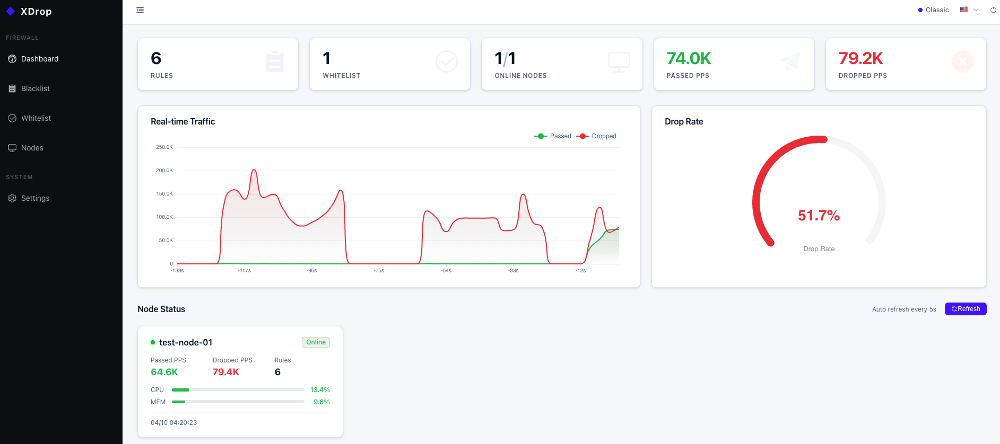
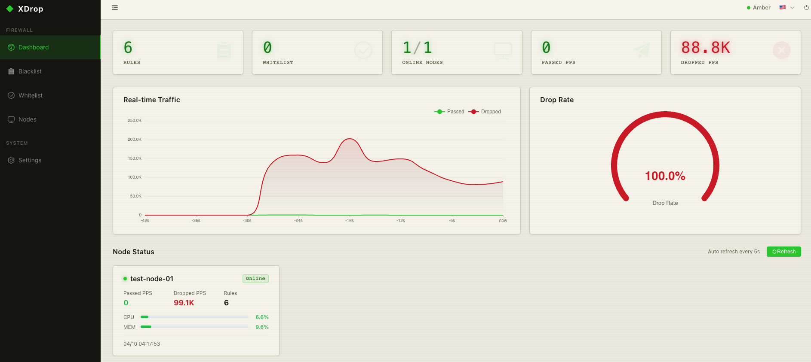

<div align="center">
  

  <h1>XDrop</h1>

  <p>Distributed XDP/eBPF firewall with wire-speed packet filtering and a central management controller.</p>

  [](https://go.dev)
  [](https://vuejs.org)
  [](LICENSE)
  [](https://claude.com/product/claude-code)

  [中文文档](README.zh.md)
</div>

---

## What is XDrop?

XDrop is a distributed, high-performance packet filtering system built on Linux XDP (eXpress Data Path). It attaches BPF programs directly to network interface drivers — bypassing the kernel network stack entirely — to drop, pass, or rate-limit traffic at the earliest possible point in the receive path.

The system has two components:

- **Node Agent** — runs on each filtering host, manages the BPF data plane, and exposes a REST API
- **Controller** — central management plane with a Web UI, stores rules in SQLite, and pushes them to all registered nodes

| Classic Theme | Amber Theme |
|:---:|:---:|
|  |  |

```
┌──────────────────────────────────────────────────────────────────────┐
│                            Controller                                │
│                                                                      │
│   ┌──────────────┐   ┌─────────────┐   ┌────────────┐   ┌────────┐  │
│   │  Web UI      │   │  REST API   │   │  Sync      │   │SQLite  │  │
│   │  (Vue 3 +    │   │  (Gin)      │   │  Scheduler │   │  DB    │  │
│   │  ECharts)    │   │             │   │            │   │        │  │
│   └──────────────┘   └─────────────┘   └────────────┘   └────────┘  │
└─────────────────────────────────┬────────────────────────────────────┘
                                  │  HTTP (rule push / health poll)
              ┌───────────────────┼───────────────────┐
              ▼                   ▼                   ▼
       ┌────────────┐      ┌────────────┐      ┌────────────┐
       │  Node 1    │      │  Node 2    │      │  Node N    │
       │  Agent     │      │  Agent     │      │  Agent     │
       │ ┌────────┐ │      │ ┌────────┐ │      │ ┌────────┐ │
       │ │XDP/BPF │ │      │ │XDP/BPF │ │      │ │XDP/BPF │ │
       │ └────────┘ │      │ └────────┘ │      │ └────────┘ │
       └────────────┘      └────────────┘      └────────────┘
        Wire-speed ↑        Wire-speed ↑        Wire-speed ↑
```

---

## Key Features

### BPF Data Plane
- **Wire-speed filtering** — XDP programs run before `sk_buff` allocation; near line-rate even on commodity hardware
- **Five-tuple matching** — src/dst IP, src/dst port, protocol
- **IPv4 and IPv6** — unified rule format; IPv4 stored as IPv4-mapped IPv6 internally
- **CIDR rules** — per-direction LPM trie (src or dst prefix); supports /0–/128
- **Whitelist** — hash map bypass checked before any blacklist rule
- **Actions** — `drop`, `rate_limit` (token bucket, configurable PPS), `pass`
- **Packet length filter** — `pkt_len_min` / `pkt_len_max` (L3 total length)
- **TCP flags matching** — `tcp_flags` post-match filter (e.g. `SYN`, `SYN,ACK`, `RST`); mismatch continues wildcard fallback
- **Bitmap optimization** — 64-bit bitmap encodes which of 34 field combinations have active rules; BPF skips combinations with no rules, keeping the hot path O(1)
- **Per-rule statistics** — per-CPU `match_count` and `drop_count` aggregated by the agent

### AtomicSync (Double-Buffer Rule Publishing)
Rule updates follow an RCU-style double-buffer protocol to eliminate race conditions between writing rules and updating the lookup bitmap:

1. Write rule to the BPF hash map
2. Build updated config (bitmap, counts) in the shadow config map
3. Single atomic write flips the `active_config` selector — BPF switches atomically

This guarantees the BPF data path never sees an inconsistent bitmap/rule state.

### Deployment Modes
| Mode | Description |
|------|-------------|
| **Traditional** | Single NIC, XDP attached inline on one interface |
| **Fast-Forward** | Dual NIC gateway — XDP on both inbound and outbound interfaces; transparent L2 bridge |

### Management Plane
- Central rule storage in SQLite with full CRUD and batch APIs
- Configurable sync interval with forced-sync endpoint (`POST /api/v1/nodes/:id/sync`)
- Node health monitoring with automatic online/offline status
- Web UI: real-time traffic dashboard (ECharts), node overview, rule management, whitelist editor
- Optional API key authentication on both controller and node

---

## Repository Layout

```
xdrop/
├── node/
│   ├── bpf/          # XDP program in C (xdrop.c / xdrop.h)
│   └── agent/        # Go agent — BPF loader, API server, AtomicSync engine
├── controller/
│   ├── cmd/          # Binary entry point
│   ├── internal/     # API, service, repository, scheduler, client
│   └── web/          # Vue 3 + Element Plus + ECharts frontend
└── scripts/          # Build and service management scripts
```

- [Node Agent →](node/README.md) — XDP data plane, BPF maps, AtomicSync, API
- [Controller →](controller/README.md) — Management plane, Web UI, sync engine

---

## Requirements

| Component | Requirement |
|-----------|-------------|
| Node Agent | Linux kernel **≥ 5.9**, clang ≥ 11, Go ≥ 1.24, root / CAP_NET_ADMIN |
| Controller | Go ≥ 1.21, Node.js ≥ 18 (build only) — runs on any OS |

> The node agent **must run on Linux** (XDP is a Linux kernel feature). The controller can be deployed anywhere.

> **Kernel floor note (v2.5+):** the node agent uses `BPF_LINK_TYPE_XDP` for
> XDP attach, which landed in Linux 5.9 (October 2020). On older kernels
> (5.8 and below) startup fails with a clear error message pointing to
> this requirement. Modern distros are covered: Debian 11+ (5.10),
> RHEL/Rocky/Alma 9+ (5.14), Ubuntu 20.04 HWE / 22.04+ (5.15+). Operators
> on legacy kernels should hold on xdrop **v2.4.2** (the last release
> using the netlink attach path) until they can upgrade.

> **BPF pinning (v2.5+):** by default the node agent pins all its BPF
> maps under `/sys/fs/bpf/xdrop/` (16 files — `blacklist`, `whitelist`,
> `cidr_blacklist`, the four LPM tries, `config_a` / `config_b`, etc.)
> so map fds survive across `systemctl restart xdrop-agent`. This
> keeps map IDs stable for `bpftool map dump pinned
> /sys/fs/bpf/xdrop/<name>` and for any external BPF tooling pointed
> at those objects. Requires `/sys/fs/bpf` to be mounted as a `bpf`
> filesystem — most modern distros do this automatically via systemd.
> If pinning fails (unmounted, EPERM, etc.) the agent silently falls
> back to non-pinned mode by default; set `bpf.pinning: require` in
> `config.yaml` for strict mode, or `disable` to opt out entirely.

For a step-by-step environment setup guide, see **[Getting Started](GETTING_STARTED.md)**.

---

## Quick Start

### 1. Build

```bash
# Build controller (frontend + Go binary)
./scripts/build-controller.sh

# Build node agent (BPF program + Go binary) — run on a Linux host
./scripts/build-node.sh
```

### 2. Configure

```bash
# Controller
cp controller/config.example.yaml controller/config.yaml
# Edit: set jwt_secret, external_api_key, and add nodes under the nodes: section

# Node agent
cp node/config.example.yaml node/config.yaml
# Edit: set interface name, node_api_key, sync_key
```

### 3. Start

```bash
# Controller (no root required)
./scripts/controller.sh start

# Node agent (requires root — XDP needs CAP_NET_ADMIN)
sudo ./scripts/node.sh start

# Check status
./scripts/controller.sh status
sudo ./scripts/node.sh status
```

The Web UI is available at `http://<controller-host>:8000` by default.

---

## API Overview

Both the controller and the node expose a versioned REST API at `/api/v1/`.

| Resource | Endpoint | Notes |
|----------|----------|-------|
| Rules | `GET/POST /api/v1/rules` | Pagination: `?page=&limit=` |
| Rule | `GET/PUT/DELETE /api/v1/rules/:id` | |
| Batch rules | `POST/DELETE /api/v1/rules/batch` | |
| Whitelist | `GET/POST/DELETE /api/v1/whitelist` | |
| Stats | `GET /api/v1/stats` | PPS, drop counts, XDP info |
| Nodes | `GET/POST /api/v1/nodes` | Controller only |
| Force sync | `POST /api/v1/nodes/:id/sync` | Controller only |

Node API requires `X-API-Key` header. Controller API key is optional (configurable).

---

## License

MIT — see [LICENSE](LICENSE).

BPF/C kernel programs (`node/bpf/`) are licensed under GPL-2.0 as required by the Linux kernel BPF subsystem.

---

## Sponsor

This project is made possible by [Hytron](https://www.hytron.io/), who generously sponsors the development tooling.

<picture>
  <source media="(prefers-color-scheme: dark)" srcset=".github/assets/sponsor-hytron-dark.png">
  
</picture>

---

<sub>Built entirely with <a href="https://claude.com/product/claude-code">Claude Code</a> — including the XDP/BPF kernel program, Go concurrency, and Vue frontend.</sub>
